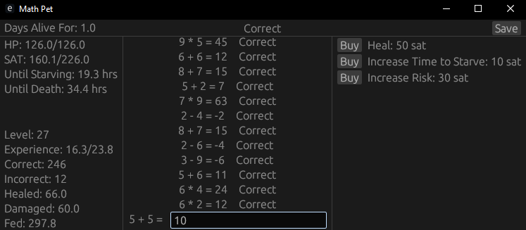

# Math Pet



This is a Tamagotchi-like game. To feed the pet, you must answer simple math problems.

The game runs in real time, so the pet needs to be fed periodically. After 24 without being fed, the pet will die. Upgrades can be bought that increase this timeframe.

The game auto-saves on close, and creates a `pet_save.json` save-file.

# Running

## REPL

With cargo:

```powershell
PS path> cargo run
```

Running the executable directly after compiling it:

```powershell
PS path> .\math-pet.exe
```

This will open a GUI in a new window.